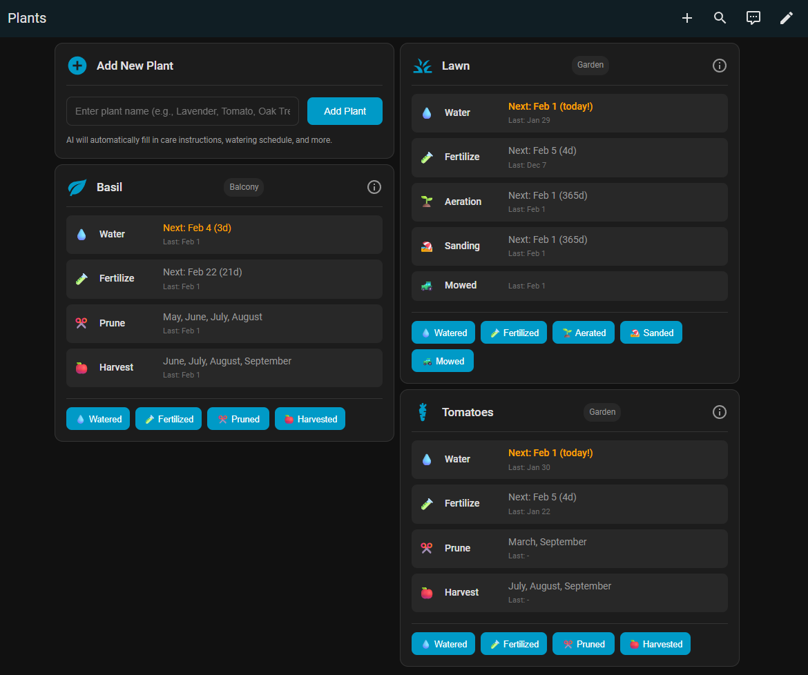
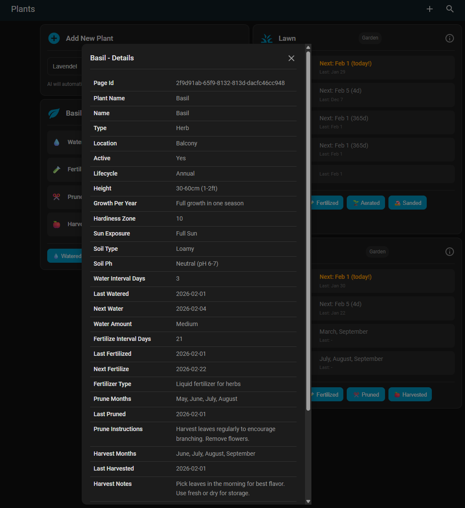
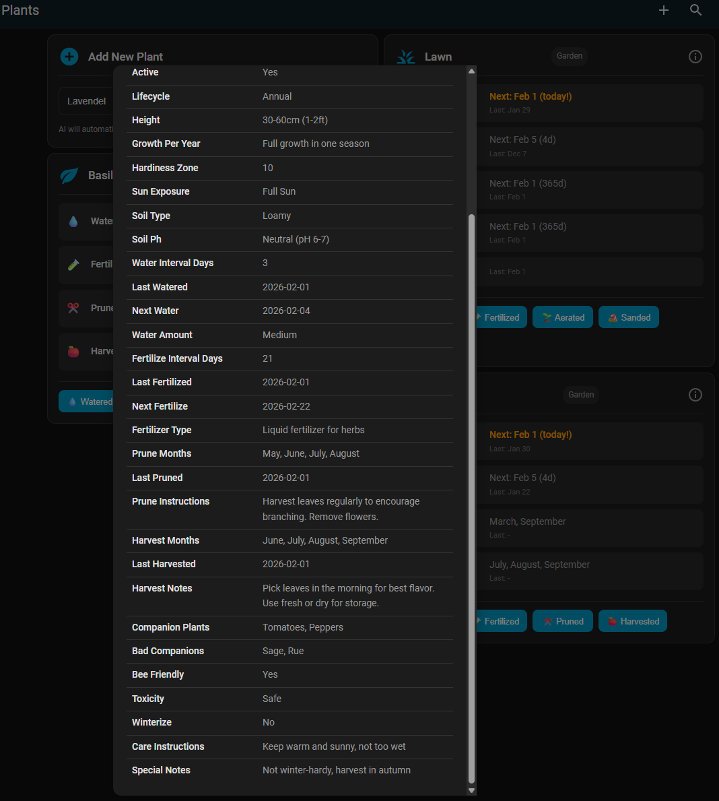

[](https://buymeacoffee.com/pfalzcraft)

# 🌱 Notion Garden Care for Home Assistant

Manage your garden with Notion and automate reminders with Home Assistant. Track watering, fertilizing, and pruning schedules for all your plants in one place.


[](https://buymeacoffee.com/pfalzcraft)

## ✨ Features

- 🌿 **Automatic Setup** - No coding required, everything happens in Home Assistant UI
- 🗄️ **Auto-Create Database** - Integration creates the Notion database for you
- 📅 **Smart Reminders** - Never forget to water, fertilize, or prune
- 📊 **Auto-Created Dashboard** - Beautiful dashboard with plant cards auto-generated on install, grouped by HA area
- 📍 **Area-Based Bulk Care** - Group plants by Home Assistant areas and water/fertilize/prune an entire area at once
- ➕ **Add Plant Form** - Easy form to add new plants directly from the dashboard
- 🃏 **Custom Plant Cards** - Interactive cards showing care schedules with action buttons
- 🔄 **Bidirectional Sync** - Update Notion from Home Assistant and vice versa
- 🪴 **Example Plants** - Pre-configured templates to get started
- 📱 **Mobile Friendly** - Works on all Home Assistant apps
- 🤖 **AI-Powered Plant Addition** - Add plants with automatic care info using your AI assistant

### Extended Plant Information

- ☀️ **Sun Exposure** - Track light requirements (Full Sun, Partial Sun, Shade)
- 🍅 **Harvest Info** - Record harvest months and notes
- 🌻 **Companion Plants** - Get planting suggestions
- 🚫 **Bad Companions** - Plants to avoid planting nearby
- 🐝 **Bee Friendly** - Mark pollinator-friendly plants
- ⚠️ **Toxicity Warnings** - Safety info for pets and children
- 🌱 **Lawn Care** - Track aeration and sanding schedules
- 🔄 **Lifecycle** - Perennial, Annual, or Biennial
- 🌡️ **Hardiness Zone** - USDA zones 1-13
- 🪴 **Soil Type** - Sandy, Loamy, Clay, etc.
- ⚗️ **Soil pH** - Acidic, Neutral, or Alkaline
- 📏 **Height** - Expected mature height
- 📈 **Growth per Year** - Annual growth rate
- ❄️ **Winterize** - Winter protection requirements

## 🚀 Quick Start

### Step 1: Create a Notion Account (if you don't have one)

1. Go to [https://www.notion.so/signup](https://www.notion.so/signup)
2. Sign up for a free account (email or Google/Apple)
3. Complete the onboarding

### Step 2: Create Notion Integration (2 minutes)

1. Go to [https://www.notion.so/my-integrations](https://www.notion.so/my-integrations)
2. Click **"+ New integration"**
3. Fill in the required fields:
   - **Name:** `Home Assistant Garden`
   - **Associated workspace:** Select your Notion workspace
   - **Type:** Leave as **Internal**
4. Under **Capabilities**, enable at minimum:
   - ✅ Read content
   - ✅ Update content
   - ✅ Insert content
5. Click **"Save"**
6. **Copy the token** (starts with `ntn_...`) from the **Secrets** tab

> **Note:** The Notion integration creation page has several required fields. Make sure to select your workspace and enable the content capabilities listed above — without them the integration will not be able to read or write to your Notion database.

### Step 3: Create a Page in Notion (1 minute)

1. Open Notion
2. Create a new blank page (e.g., "Gardening" or "Home Assistant")
3. **Connect your integration:**
   - Click **"..."** (three dots, top right)
   - Select **"Connections"**
   - Add **"Home Assistant Garden"**
   - Confirm
4. **Copy the page URL** from your browser

### Step 4: Install & Configure in Home Assistant (3 minutes)

#### Install the Integration

**Option A: HACS (Coming Soon)**
1. Open HACS → Integrations
2. Search "Notion Garden Care"
3. Install

**Option B: Manual Install**
```bash
cd /config/custom_components
git clone https://github.com/pfalzcraft/notion-garden-care.git
cp -r notion-garden-care/custom_components/notion_garden_care .
rm -rf notion-garden-care
```

Restart Home Assistant.

#### Setup in UI

1. Go to **Settings** → **Devices & Services**
2. Click **"+ Add Integration"**
3. Search **"Notion Garden Care"**
4. Follow the setup wizard:
   - **Screen 1:** Paste your Notion token
   - **Screen 2:** Paste your page URL
   - ✅ Keep "Create database automatically" checked
   - ✅ Keep "Add example plants" checked
   - ✅ Keep "Create individual sensors for each plant" checked (or uncheck for aggregate sensors only)
   - Click **Submit**

**That's it!** 🎉

The integration will:
- ✅ Create the "Garden Care" database in Notion
- ✅ Set up all properties and formulas
- ✅ Add 5 example plants (Tomatoes, Rose, Apple Tree, Basil, Lawn)
- ✅ Create 5 aggregate sensors in Home Assistant
- ✅ Create individual sensors for each plant (if enabled)
- ✅ Register actions for plant updates
- ✅ Register frontend resources automatically (custom plant card and area card)
- ✅ Create the Garden Care dashboard automatically in YAML mode
- ✅ Write `garden-care.yaml` with a self-healing root card that discovers plants at runtime

### Step 5: Configure AI Agent (Optional - Recommended)

To get the full potential of the integration, configure an AI conversation agent for automatic plant care information:

1. **Install a Conversation Agent** (if you don't have one):
   - Go to **Settings** → **Devices & Services** → **Add Integration**
   - Add one of: **OpenAI Conversation**, **Google Generative AI**, **Anthropic**, or any other AI agent
   - Configure the agent with your API key

2. **Connect to Garden Care:**
   - Go to **Settings** → **Devices & Services**
   - Find **Notion Garden Care** → Click **Configure** (gear icon)
   - Select your **Conversation Agent** from the dropdown
   - Click **Submit**

3. **Add Plants with AI:**
   - Use the **Add Plant** form on the dashboard, or call the action:
   ```yaml
   action: notion_garden_care.add_plant
   data:
     plant_name: "Lavender"
   ```
   - The AI will automatically fill in all care details (watering schedule, sun exposure, pruning months, etc.) tailored to your local climate using your Home Assistant location settings (coordinates, elevation, country, timezone)
   - After adding, assign the plant's sensor to a **Home Assistant Area** (Settings → Devices & Services → entity → Area) to group it with other plants in the same spot

### Verify Resources (if cards don't appear)

The integration automatically registers frontend resources. If custom cards don't appear:

1. Open browser **Developer Tools** (F12) → **Console**
2. Look for: `PLANT-CARE-CARD Loaded`, `GARDEN-AREA-CARD Loaded`, and `GARDEN-CARE-ROOT-CARD Loaded`
3. If missing, see [Add Resources Manually](#add-resources-manually-if-needed) section below

## 📊 What You Get

### Sensors

After setup, you'll have these sensors:

**Aggregate Sensors (always created):**
- `sensor.notion_garden_care_database` - All plants from Notion
- `sensor.plants_to_water` - Plants needing water today
- `sensor.plants_to_fertilize` - Plants needing fertilizer today
- `sensor.plants_to_prune` - Plants to prune this month
- `sensor.active_plants_count` - Total active plants

**Individual Plant Sensors (optional, enabled by default):**
- `sensor.garden_care_tomatoes` - Individual sensor for Tomatoes
- `sensor.garden_care_rose_bush` - Individual sensor for Rose Bush
- `sensor.garden_care_apple_tree` - Individual sensor for Apple Tree
- ... one sensor per plant in your database!

Each plant sensor shows:
- **State:** Status text ("OK", "Needs Water", "Needs Fertilizer", "Needs Pruning")
- **Attributes:** All plant properties from Notion (type, watering schedule, etc.)
- **Icon:** Changes based on plant type (tree, vegetable, herb, etc.)

#### 📋 Detailed Sensor Logic

> **📚 For complete documentation with examples and troubleshooting, see [docs/SENSORS.md](docs/SENSORS.md)**

Understanding when plants appear in each sensor:

**🚰 Plants to Water** (`sensor.plants_to_water`)
- **Shows when:** The "Next Water" date is **today or in the past**
- **Example:** If today is Jan 25 and "Next Water" shows Jan 24 or Jan 25 → Plant appears in sensor
- **Formula:** `Next Water = Last Watered + Water Interval (days)`
- **Attributes:** Lists plant names and due dates
- **Updates:** Every hour automatically

**🌿 Plants to Fertilize** (`sensor.plants_to_fertilize`)
- **Shows when:** The "Next Fertilize" date is **today or in the past**
- **Example:** If today is Jan 25 and "Next Fertilize" shows Jan 20 → Plant appears in sensor
- **Formula:** `Next Fertilize = Last Fertilized + Fertilize Interval (days)`
- **Attributes:** Lists plant names and due dates
- **Updates:** Every hour automatically

**✂️ Plants to Prune** (`sensor.plants_to_prune`)
- **Shows when:** The **current month** is in the plant's "Prune Months" list
- **Example:** If today is January and plant has "January, March" in Prune Months → Plant appears
- **Note:** Month-based (not date-based like watering/fertilizing)
- **Attributes:** Lists plant names and all their pruning months
- **Updates:** Every hour automatically

**🌺 Active Plants Count** (`sensor.active_plants_count`)
- **Shows when:** The "Active" checkbox is **checked**
- **Purpose:** Track only plants you're actively caring for (excludes dead/removed plants)
- **Example:** 10 plants total, 2 marked inactive → Sensor shows 8
- **Updates:** Every hour automatically

**🗄️ Notion Garden Care Database** (`sensor.notion_garden_care_database`)
- **Shows:** Total count of **all plants** in the database (no filtering)
- **Attributes:** Contains full raw data from Notion
- **Note:** All plants are counted regardless of active status

### Actions

Update your plants from Home Assistant (11 actions available):

```yaml
# Mark single plant as watered (today)
action: notion_garden_care.mark_as_watered
data:
  entity_id: sensor.garden_care_tomatoes  # Or use plant_name

# Mark plant as watered on a specific date
action: notion_garden_care.mark_as_watered
data:
  plant_name: "Tomatoes"
  date: "2026-01-20"

# Water ALL plants in a Home Assistant area at once
action: notion_garden_care.mark_as_watered
data:
  area_id: balcony   # HA area ID — waters every plant sensor in that area

# Mark plant as fertilized
action: notion_garden_care.mark_as_fertilized
data:
  plant_name: "Rose Bush"

# Fertilize all plants in an area
action: notion_garden_care.mark_as_fertilized
data:
  area_id: garden

# Mark plant as pruned
action: notion_garden_care.mark_as_pruned
data:
  plant_name: "Apple Tree"

# Mark plant as harvested
action: notion_garden_care.mark_as_harvested
data:
  plant_name: "Tomatoes"

# Mark lawn as aerated
action: notion_garden_care.mark_as_aerated
data:
  plant_name: "Lawn"

# Mark lawn as sanded
action: notion_garden_care.mark_as_sanded
data:
  plant_name: "Lawn"

# Mark lawn as mowed
action: notion_garden_care.mark_as_mowed
data:
  plant_name: "Lawn"

# Update any property (generic action with dropdown)
action: notion_garden_care.update_plant_property
data:
  entity_id: sensor.garden_care_tomatoes
  property_name: "Water Interval (days)"
  property_value: "5"

# Add a new plant using AI
action: notion_garden_care.add_plant
data:
  plant_name: "Lavender"

# Refresh data from Notion
action: notion_garden_care.refresh_database
```

#### Action Parameters

All `mark_as_*` actions accept:
- `entity_id` (entity selector) - Select plant from dropdown (or)
- `plant_name` (string) - Name of the plant (or)
- `page_id` (string) - Notion page ID (or)
- `area_id` (area selector) - **Update all plants in a HA area at once**
- `date` (optional) - Date in YYYY-MM-DD format (defaults to today)

The `update_plant_property` action accepts:
- `entity_id`, `plant_name`, or `page_id` - To identify the plant
- `property_name` (required) - Select from dropdown with all available properties
- `property_value` (required) - Value to set (auto-detects type: number, checkbox, date, multi-select, or text)

The `add_plant` action accepts:
- `plant_name` (required) - Name of the plant to add (AI will fill in all care details)

### AI-Powered Plant Addition

Add plants with automatic care information using AI:

1. **Configure AI Agent:**
   - Go to **Settings** → **Devices & Services**
   - Find **Notion Garden Care** → Click **Configure** (gear icon)
   - Select your **Conversation Agent** (e.g., OpenAI, Google AI, Claude)
   - Click **Submit**

2. **Add Plants:**
   ```yaml
   action: notion_garden_care.add_plant
   data:
     plant_name: "Lavender"
   ```

The AI will automatically fill in:
- Plant type and location
- Lifecycle (perennial/annual/biennial)
- Hardiness zone and soil requirements
- Sun exposure requirements
- Watering schedule and amount
- Fertilizing schedule and type
- Pruning months and instructions
- Harvest information (if applicable)
- Height and growth rate
- Companion plants and bad companions
- Bee-friendly status
- Toxicity warnings
- Winter protection requirements
- Care instructions and special notes
- **URLs to care guides** (care, pruning, and harvesting instructions from reputable gardening sites)

### Automation Blueprints

Set up reminders in seconds:

1. **Settings** → **Automations & Scenes**
2. **Create Automation** → **Start with blueprint**
3. Choose:
   - **Garden Care - Watering Reminder** (daily)
   - **Garden Care - Fertilizing Reminder** (daily)
   - **Garden Care - Pruning Reminder** (monthly)

## 📱 Dashboard

### Dashboard Setup

The integration **automatically creates** the Garden Care dashboard on first install and after any reload. No manual steps are required.

The dashboard uses a single `custom:garden-care-root-card` element that **auto-discovers all plant sensors at runtime** and groups them by Home Assistant area. This means:

- **No YAML regeneration** — the dashboard file is static; all dynamic content happens in the browser
- **Always up to date** — new plants appear automatically after a browser refresh
- **Self-healing** — if the dashboard is deleted, reload the integration to recreate it; if a wrong-mode dashboard existed at the `garden-care` URL, the integration automatically detects and replaces it

The dashboard includes:
- **Add Plant Form** - Easy form to add new plants at the top
- **Area Headers** - One section per Home Assistant area with **Water All / Fertilize All / Prune All / Harvest All** buttons
- **Plant Cards** - Individual cards for each plant with care schedules and action buttons
- Plants not assigned to any area appear at the bottom

> **Tip:** Assign plant sensors to HA areas in **Settings → Devices & Services → (entity) → Area** to group them in the dashboard. Changes appear after the next browser refresh.

### Add Plant Card

At the top of the dashboard you'll find the **Add Plant** form:
- Enter a plant name and click **Add Plant**
- AI automatically fills in the full care profile
- **Duplicate protection** — won't create a plant that already exists
- Shows loading/success/error feedback inline

### Plant Care Card

Each plant card displays:
- **Clickable plant name** — click to open the HA more-info dialog for the entity
- **Area label** — shown below the plant name in smaller text; updates live when area assignment changes
- Plant icon that changes based on type (flower, tree, vegetable, etc.)
- Care schedule with both **Next** and **Last** dates:
  - Water: next date with overdue indicator + last watered date
  - Fertilize: next date with overdue indicator + last fertilized date
  - Prune: months (highlighted if current month) + last pruned date
  - Harvest: months (highlighted if current month) + last harvested date
  - Aeration / Sanding / Mowed: lawn plants only
- **Info button** — click to see all plant attributes in a popup
- **Action buttons** — mark tasks complete with loading/success/error feedback
- **Delete button** — remove the plant from Notion (with inline confirmation)

### Manual Dashboard Setup

If the dashboard wasn't created automatically (e.g. the HA API was unavailable during setup):

1. **Settings** → **Dashboards** → **Add Dashboard**
2. Title: `Garden Care`, Icon: `mdi:flower`
3. Select **YAML** mode, Filename: `garden-care.yaml`
4. Click **Create**, then reload the integration

> **Tip:** If the dashboard exists but is empty, delete it in **Settings → Dashboards**, then reload the integration. It will be recreated in YAML mode with the self-healing root card.

### Add Resources Manually (if needed)

On startup the integration automatically registers both JS resources in the global Lovelace resource store (`.storage/lovelace_resources`) and serves them at `/notion-garden-care/`. You should see them listed under **Settings → Dashboards → three dots → Resources**.

If the custom cards still don't appear after a restart:

#### When Manual Setup is Required

- Dashboard shows "Custom element doesn't exist: plant-care-card"
- Cards appear blank or show errors
- After upgrading from an older version

#### Step-by-Step Resource Setup

1. **Open Resources Page:**
   - Go to **Settings** → **Dashboards**
   - Click the **three dots menu** (top right) → **Resources**

2. **Add Plant Care Card Resource:**
   - Click **+ Add Resource**
   - URL: `/notion-garden-care/plant-care-card.js`
   - Resource Type: **JavaScript Module**
   - Click **Create**

3. **Add Area Card Resource:**
   - Click **+ Add Resource**
   - URL: `/notion-garden-care/garden-care-strategy.js`
   - Resource Type: **JavaScript Module**
   - Click **Create**

4. **Refresh Browser:**
   - Hard refresh your browser: **Ctrl+Shift+R** (Windows/Linux) or **Cmd+Shift+R** (Mac)
   - Or clear browser cache and reload

#### Verify Resources are Loading

Open your browser's Developer Tools (F12) and check the Console tab. You should see:
```
PLANT-CARE-CARD         Loaded
GARDEN-AREA-CARD        Loaded
GARDEN-CARE-ROOT-CARD   Loaded
```

If you see 404 errors for the JS files, verify the integration is installed correctly in `custom_components/notion_garden_care/` and restart Home Assistant.

### Use Plant Care Card Individually

You can also add the Plant Care Card to any dashboard:

1. **Edit Dashboard** → **Add Card**
2. Search for "Plant Care Card"
3. Select a plant entity from the dropdown

```yaml
type: custom:plant-care-card
entity: sensor.garden_care_tomatoes
```

## 🌱 Notion Database Structure

The integration creates these properties automatically:

### Basic Info
- **Name** - Plant name
- **Type** - Plant, Tree, Shrub, Vegetable, Herb, Lawn
- **Active** - Is the plant still active?

> **Where's Location?** Location is no longer a Notion field. Use **Home Assistant Areas** instead — assign each plant sensor to an area in Settings → Devices & Services. This integrates with HA natively and enables area-based bulk actions.

### Sun & Environment
- **Sun Exposure** - Full Sun, Partial Sun, Partial Shade, Full Shade

### Watering
- **Water Interval (days)** - Days between watering
- **Last Watered** - Date of last watering
- **Next Water** - Auto-calculated next watering date ✨
- **Water Amount** - Low, Medium, High

### Fertilizing
- **Fertilize Interval (days)** - Days between fertilizing
- **Last Fertilized** - Date of last fertilizing
- **Next Fertilize** - Auto-calculated next date ✨
- **Fertilizer Type** - Type of fertilizer

### Pruning
- **Prune Months** - Months when pruning needed
- **Prune Instructions** - Detailed instructions
- **Last Pruned** - Date of last pruning

### Harvest
- **Harvest Months** - When to harvest
- **Harvest Notes** - Harvest tips and timing
- **Last Harvested** - Date of last harvest

### Plant Characteristics
- **Lifecycle** - Perennial, Annual, or Biennial
- **Hardiness Zone** - USDA zones 1-13
- **Soil Type** - Sandy, Loamy, Clay, Silty, Peaty, Chalky, Any
- **Soil pH** - Acidic (pH < 6), Neutral (pH 6-7), Alkaline (pH > 7), Any
- **Height** - Expected mature height
- **Growth per Year** - Annual growth rate
- **Winterize** - Does it need winter protection?

### Companion & Safety
- **Companion Plants** - Plants that grow well together
- **Bad Companions** - Plants to avoid planting nearby
- **Bee Friendly** - Is it good for pollinators?
- **Toxicity** - Safety warnings (Safe, Toxic to Pets, Toxic to Children, Toxic to Both)

### Lawn Care
- **Aeration Interval (days)** - Days between aeration
- **Last Aeration** - Date of last aeration
- **Next Aeration** - Auto-calculated ✨
- **Sanding Interval (days)** - Days between sanding
- **Last Sanded** - Date of last sanding
- **Next Sanding** - Auto-calculated ✨
- **Last Mowed** - Date of last mowing

### Notes & Instructions
- **Care Instructions** - General care tips
- **Care Instructions URL** - Link to detailed care guide
- **Prune Instructions URL** - Link to pruning guide
- **Harvest Instructions URL** - Link to harvesting guide
- **Special Notes** - Special requirements
- **Notes** - Free-form notes

## 🎯 How It Works

```
┌─────────────────┐         ┌──────────────────┐         ┌─────────────────┐
│  Home Assistant │◄────────┤   Notion API     ├────────►│     Notion      │
│   Integration   │  Sync   │   (REST)         │  Create │    Database     │
└─────────────────┘         └──────────────────┘         └─────────────────┘
        │                                                          │
        │                                                          │
        ▼                                                          ▼
  5 Sensors Created                                     Auto-create DB
  4 Services Ready                                      Add Properties
  Blueprints Available                                  Formula Fields
```

## 🐛 Troubleshooting

### Integration doesn't appear

**Solution:**
1. Verify files are in `custom_components/notion_garden_care/`
2. Restart Home Assistant
3. Check logs: **Settings** → **System** → **Logs**

### Database not created

**Solution:**
1. Ensure the parent page exists in Notion
2. Verify the integration is connected to the page:
   - Open page in Notion → **"..."** → **Connections**
   - "Home Assistant Garden" should be listed
3. Try again with a fresh page

### Sensors show "Unavailable"

**Solution:**
1. Check if integration is connected in Notion (see above)
2. Verify token is correct
3. Call `notion_garden_care.refresh_database` action
4. Check Home Assistant logs

## 📝 Example Use Cases

### Morning Routine Automation

```yaml
automation:
  - alias: "Morning Garden Report"
    trigger:
      - platform: time
        at: "07:00:00"
    actions:
      - action: notify.mobile_app
        data:
          title: "Good Morning! Garden Update"
          message: >
            🌱 {{ states('sensor.active_plants_count') }} plants total
            💧 {{ states('sensor.plants_to_water') }} need water
            🌿 {{ states('sensor.plants_to_fertilize') }} need fertilizer
```

### Water an Entire Area

```yaml
# Water all plants on the balcony every evening
automation:
  - alias: "Evening Balcony Watering"
    trigger:
      - platform: time
        at: "19:00:00"
    actions:
      - action: notion_garden_care.mark_as_watered
        data:
          area_id: balcony
```

### Mark as Done Button

```yaml
# Create a button to mark plant as watered
type: button
name: Water Tomatoes
tap_action:
  action: perform-action
  perform_action: notion_garden_care.mark_as_watered
  data:
    plant_name: Tomatoes
icon: mdi:watering-can
```

## 🤝 Contributing

Contributions are welcome!

1. Fork the repository
2. Create feature branch (`git checkout -b feature/AmazingFeature`)
3. Commit changes (`git commit -m 'Add AmazingFeature'`)
4. Push to branch (`git push origin feature/AmazingFeature`)
5. Open Pull Request

## 📄 License

This project is licensed under the MIT License - see the [LICENSE](LICENSE) file for details.

## 🙏 Acknowledgments

- [Home Assistant](https://www.home-assistant.io/) - Open source home automation
- [Notion](https://www.notion.so/) - All-in-one workspace
- [Notion API](https://developers.notion.com/) - Official Notion API

## 💬 Support

- **Issues:** [GitHub Issues](https://github.com/pfalzcraft/notion-garden-care/issues)
- **Discussions:** [GitHub Discussions](https://github.com/pfalzcraft/notion-garden-care/discussions)
- **Installation Guide:** [INSTALLATION.md](INSTALLATION.md)

## ☕ Buy Me a Coffee

If you find this integration helpful, consider supporting the development:

[](https://buymeacoffee.com/pfalzcraft)

Your support helps keep this project maintained and improved!

## 📸 Screenshots

### Dashboard Overview
The Garden Care dashboard shows all your plants with care schedules and action buttons.



### Plant Details
Click on any plant to see detailed information including care schedules, location, and all attributes.





---

## Advanced Usage (For Developers)

If you want to use the Python scripts directly without Home Assistant:

See [docs/standalone_setup.md](docs/standalone_setup.md) for manual database creation.

---

**Made with 🌱 for gardeners who love automation**

**No Python knowledge required • No YAML editing needed • Just works ✨**

---

<p align="center">
  <a href="https://buymeacoffee.com/pfalzcraft">
    
  </a>
</p>
